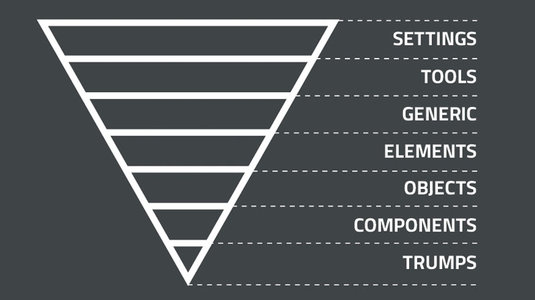

# bga-style

Styles to jumpstart your BGA page, built in SCSS, modeled after [Inverted Triangle CSS (ITCSS)](https://www.creativebloq.com/web-design/manage-large-css-projects-itcss-101517528).

## Using in your project

```scss
// Load BGA fonts
@import url('https://use.typekit.net/mqd7hhp.css');

// Load BGA styles
@import '~bga-style/scss/main';

// Or, resolving from properties sass or style in package.json
@import '~bga-style';
```

## Structure

**ITCSS** is a methodology developed by Harry Roberts that models our project as an upside-down triangle of increasing specificity.



Each layer is organized into its own subdirectory (e.g. `layers/settings`) with a hack-ish index file (e.g. `layers/settings/_.scss`) and a README.

1. [**Settings**](scss/layers/settings) — Global settings

2. [**Tools**](scss/layers/tools) — Global mixins and functions

3. [**Generic**](scss/layers/generic) — High-level styles (e.g. CSS resets, global box-sizing)

4. [**Elements**](scss/layers/elements) — Bare, unclassed HTML elements (e.g. `p`, `h1`)

5. [**Objects**](scss/layers/objects) — Generic class-based selectors (e.g. `.wrapper`, layout classes)

6. [**Components**](scss/layers/components) — Class-based selectors styling specific UI components (e.g. `.pullquote`)

7. [**Trumps**](scss/layers/trumps) — Explicit rules, usually `!important` (e.g. `.text-center`)
