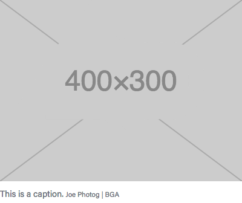
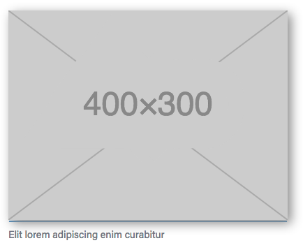
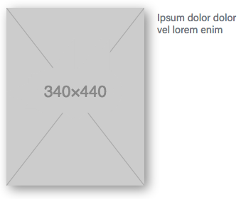
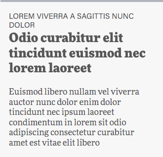
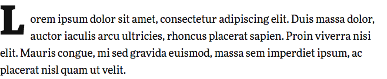
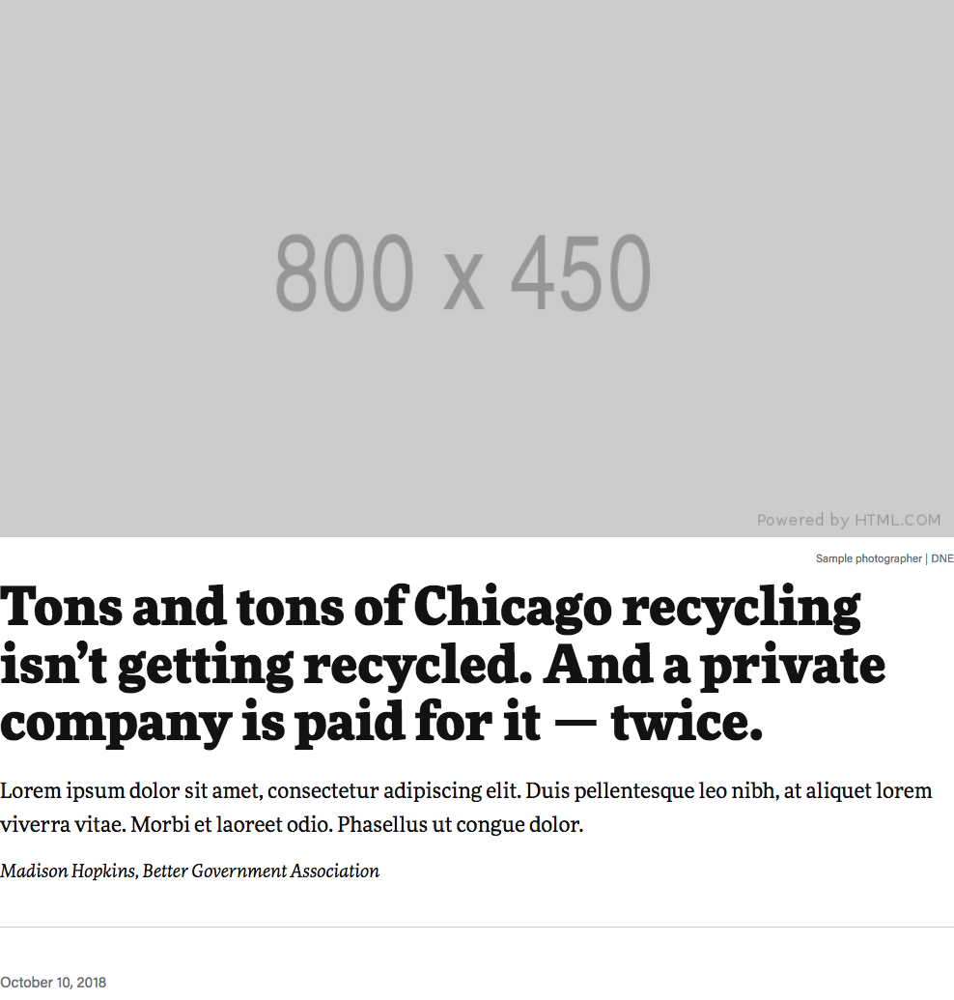
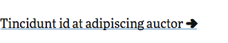
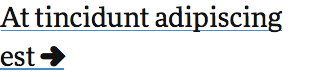
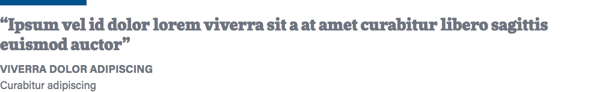

# 6. Components

From [Manage large CSS projects with ITCSS](https://www.creativebloq.com/web-design/manage-large-css-projects-itcss-101517528#layers), Harry Roberts:

> The Components layer is where we begin to style recognisable pieces of UI. We're still binding onto classes here, so our specificity hasn't yet increased. However, this layer is more explicit than the last one in that we are now styling explicit, designed pieces of the DOM.
>
> We shouldn't find any selectors with a lower specificity than one class in this layer. This is where the majority of your work will happen after initial project set-up. Adding new components and features usually makes up the vast majority of development.

## In this layer

### Art

#### Usage



```html
<!-- Photo -->
<figure class="photo">
  
  <figcaption>
    This is a caption.
    <span class="cutline">Joe Photog | BGA</span>
  </figcaption>
</figure>
```



```html
<!-- Document -->
<figure class="doc">
  <a href="#" class="doc-link">
    
  </a>
  <figcaption>...</figcaption>
</figure>
```



```html
<!-- Small document -->
<figure class="doc is-small">
  <a href="#" class="doc-link">
    
  </a>
  <figcaption>...</figcaption>
</figure>
```

### Card

#### Usage



```html
<div class="card">
  <p class="card-subtitle">...</p>
  <p class="card-title">...</p>
  ...
</div>
```

### Dropcap

#### Usage



```html
<p>
  <span class="dropcap">I</span>t was the best of times...</span>
</p>
```

Or use a `:first-letter` selector.

```scss
section p:first-of-type::first-letter {
  @extend .dropcap;
}
```

```html
<p>It was the best of times...</p>
```

### Footer

#### Usage

```html
<footer class="nav-bottom">
  <a
    class="logo"
    href="https://www.bettergov.org/"
    title="Better Government Association"
    target="_top"
  >
    <i class="icon--bga-logo"></i>
  </a>
  <button class="share caps sans">Share</button>
  <ul class="share-menu">
    <a class="share--facebook" title="Share on Facebook" href="#"
      ><i class="icon--facebook"></i
    ></a>
    <a class="share--twitter" title="Share on Twitter" href="#"
      ><i class="icon--twitter"></i
    ></a>
    <a class="share--email" title="Email" href="#"
      ><i class="icon--email"></i
    ></a>
    <a class="share--print" title="Print" href="#"
      ><i class="icon--print"></i
    ></a>
  </ul>
</footer>
```

#### Other notes

You can enable a sticky footer (i.e. at the bottom of the page, even if the page content is less than the page height) by setting the variable `$is-footer-sticky` to true.

### Intro

#### Usage



```html
<section class="intro">
  <header class="">
    <figure class="lede-image">
      

      <figcaption class="caption">
        A caption for our header image.
        <span class="cutline">Sample photographer | DNE</span>
      </figcaption>
    </figure>

    <div class="lede-copy">
      <h1 class="hed">
        Tons and tons of Chicago recycling isn’t getting recycled. And a private
        company is paid for it — twice.
      </h1>
      <p class="dek">
        Lorem ipsum dolor sit amet, consectetur adipiscing elit. Duis
        pellentesque leo nibh, at aliquet lorem viverra vitae. Morbi et laoreet
        odio. Phasellus ut congue dolor.
      </p>
      <div class="bylines">
        Madison Hopkins, Better Government Association
      </div>
    </div>
  </header>

  <hr />

  <div class="info">
    <p>
      <span class="timestamp">
        <time datetime="2018-10-10T05:00-0500">October 10, 2018</time>
      </span>
    </p>
  </div>
</section>
```

#### Notes

You can apply several different classes to the `<header>` element to change the styling.

- `header--heroic`
- `header--top`
- `header--center`
- `header--invert`
- `header--drop-mobile`
- `header--split-right`
- `header--split-left`

### Link

#### Usage



```html
<!-- Link -->
<div class="link">
  <a href="#">
    <span class="link-text">...</span>
  </a>
</div>
```



```html
<!-- Large link -->
<div class="link link-large">
  <a href="#">
    <span class="link-text">...</span>
  </a>
</div>
```

### Navigation

#### Usage

```html
<nav title="navigation" class="global">
  <div class="navbar-brands">
    <a
      class="navbar-brand"
      href="https://www.bettergov.org/"
      title="Better Government Association"
      target="_top"
    >
      <i class="icon--bga-logo"></i>
    </a>
  </div>

  <button class="share caps sans unstyled">
    Share
    <i class="icon--share"></i>
  </button>

  <ul class="share-menu">
    <a class="share--facebook" title="Share on Facebook" href="#"
      ><i class="icon--facebook"></i
    ></a>
    <a class="share--twitter" title="Share on Twitter" href="#"
      ><i class="icon--twitter"></i
    ></a>
    <a class="share--email" title="Email" href="#"
      ><i class="icon--email"></i
    ></a>
    <a class="share--print" title="Print" href="#"
      ><i class="icon--print"></i
    ></a>
  </ul>
</nav>
```

### Pullquote

#### Usage



```html
<aside class="pullquote">
  <div class="quote">“...”</div>

  <footer>
    <div class="quote-speaker">...</div>
    <div class="quote-role">...</div>
  </footer>
</aside>
```

### Share

#### Usage

See [Navigation](#navigation) and [Footer](#footer).

---

_[Table of contents](../../../README.md#structure)_

[← Previous layer: Objects](../objects)

[Next layer: Trumps →](../trumps)
